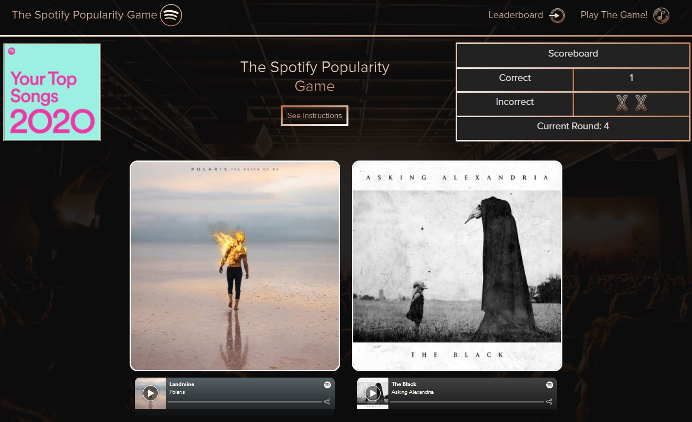

# The Spotify Popularity Game

## Links
* Repository Link: [GitHub](https://github.com/ryanweiler92/The-Spotify-Popularity-Game)
* Application Link: [The Spotify Popularity Game](https://spotify-popularity-game.herokuapp.com/)
* For any additional questions please reach out to ryanweiler92@gmail.com

## Description
The Spotify Popularity Game is a game for Spotify users which presents 2 songs each round where users must guess which one is more popular. Users will have to log into their Spotify accounts which will allow them to chose from their own playlists or one of Spotify's featured playlist for the day. After each game is completed users have the option to post their scores to the leaderboard. 

## Table of Contents
* [Installation](#installation)
* [Usage](#usage)
* [Contributors](#contributors)
* [Tests](#tests)
* [License](#license)

## Installation
No installation is required. 

## Usage

## Contributors

* [Ryan-Weiler](https://github.com/ryanweiler92)

## License
